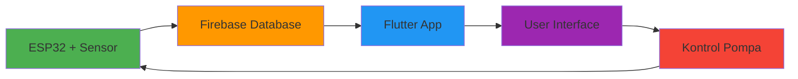

# 🌱 Smart Irrigation System

<div align="center">
  
  
  
  
  
</div>

<div align="center">
  <h3>🚀 Sistem Irigasi Pintar Berbasis IoT dengan Flutter & Firebase</h3>
  <p>Aplikasi mobile yang terintegrasi dengan ESP32 untuk monitoring dan kontrol sistem irigasi otomatis secara real-time.</p>
</div>

---

## 📋 Daftar Isi

- [✨ Fitur Utama](#-fitur-utama)
- [🛠️ Teknologi yang Digunakan](#️-teknologi-yang-digunakan)
- [🎯 Cara Kerja Sistem](#-cara-kerja-sistem)
- [📱 Screenshot](#-screenshot)
- [🔧 Instalasi](#-instalasi)
- [🚀 Penggunaan](#-penggunaan)
- [🏗️ Struktur Proyek](#️-struktur-proyek)
- [📊 Fitur Dashboard](#-fitur-dashboard)
- [🔥 Integrasi Firebase](#-integrasi-firebase)
- [🤝 Kontribusi](#-kontribusi)
- [📄 Lisensi](#-lisensi)

---

## ✨ Fitur Utama

### 🎛️ **Kontrol Sistem**
- **Mode Otomatis**: Sistem akan menyiram tanaman secara otomatis berdasarkan tingkat kelembapan tanah
- **Mode Manual**: Kontrol manual pompa air dengan timer yang dapat disesuaikan
- **Real-time Monitoring**: Pemantauan status kelembapan tanah secara langsung

### 📊 **Dashboard Interaktif**
- **Grafik Kelembapan**: Visualisasi data kelembapan tanah dalam bentuk chart
- **Status Tanah**: Indikator visual status tanah (Basah/Kering/Lembap)
- **Kontrol Pompa**: Tombol on/off pompa dengan status real-time
- **Riwayat Data**: Histori lengkap aktivitas sistem irigasi

### 🔄 **Sinkronisasi Real-time**
- **Firebase Integration**: Sinkronisasi data real-time dengan database cloud
- **Multi-device Support**: Akses dari berbagai perangkat secara bersamaan
- **Offline Capability**: Bekerja offline dengan sinkronisasi otomatis

---

## 🛠️ Teknologi yang Digunakan

### 📱 **Frontend (Mobile App)**
- **Flutter 3.7+** - Framework utama untuk pengembangan aplikasi
- **Provider** - State management untuk reactive UI
- **Firebase Core** - Integrasi dengan layanan Firebase
- **Firebase Database** - Real-time database untuk sinkronisasi data
- **FL Chart** - Library untuk visualisasi grafik dan chart
- **Google Fonts** - Typography yang menarik dan profesional
- **Lottie** - Animasi yang smooth dan interaktif

### 🔥 **Backend & Database**
- **Firebase Realtime Database** - Database real-time untuk sinkronisasi data
- **Firebase Auth** - Sistem autentikasi (siap untuk implementasi)

### 🎨 **UI/UX**
- **Material Design 3** - Design system modern dan konsisten
- **Custom Animations** - Animasi yang halus dan responsif
- **Responsive Layout** - Tampilan yang optimal di berbagai ukuran layar
- **Dark/Light Theme** - Dukungan tema terang dan gelap

---

## 🎯 Cara Kerja Sistem



### 🔄 **Alur Kerja**
1. **Sensor Kelembapan** pada ESP32 membaca data kelembapan tanah
2. **Data Real-time** dikirim ke Firebase Database
3. **Flutter App** menerima update data secara real-time
4. **UI Dashboard** menampilkan status dan grafik kelembapan
5. **Sistem Otomatis** atau **Kontrol Manual** mengaktifkan pompa sesuai kebutuhan

---

## 🔧 Instalasi

### 📋 **Prasyarat**
- Flutter SDK 3.7+ 
- Dart SDK 3.0+
- Android Studio / VS Code
- Firebase Project (dengan Realtime Database)
- ESP32 dengan sensor kelembapan tanah

### 🚀 **Langkah Instalasi**

1. **Clone Repository**
   ```bash
   git clone https://github.com/username/irrigation_system.git
   cd irrigation_system
   ```

2. **Install Dependencies**
   ```bash
   flutter pub get
   ```

3. **Setup Firebase**
   - Buat project Firebase di [Firebase Console](https://console.firebase.google.com/)
   - Aktifkan Realtime Database
   - Download `google-services.json` dan letakkan di `android/app/`
   - Jalankan:
   ```bash
   flutter packages pub run build_runner build
   ```

4. **Setup ESP32**
   - Upload kode ESP32 dengan konfigurasi Firebase
   - Pastikan sensor kelembapan terhubung dengan benar

5. **Run Application**
   ```bash
   flutter run
   ```

---

## 🚀 Penggunaan

### 📱 **Navigasi Utama**
- **Dashboard Tab**: Monitoring real-time dan kontrol sistem
- **History Tab**: Riwayat data kelembapan dan aktivitas pompa

### 🎛️ **Kontrol Sistem**
- **Toggle Mode**: Beralih antara mode otomatis dan manual
- **Pump Control**: Kontrol manual pompa dengan timer
- **Refresh Data**: Update data terbaru dari sensor

### 📊 **Monitoring**
- **Real-time Chart**: Grafik kelembapan tanah
- **Status Cards**: Informasi status tanah dan pompa
- **History Log**: Riwayat lengkap aktivitas sistem

---

## 🏗️ Struktur Proyek

```
lib/
├── 📁 models/
│   └── irrigation_model.dart      # Model data dan state management
├── 📁 screens/
│   ├── home_screen.dart           # Halaman utama dengan tab navigation
│   └── splash_screen.dart         # Halaman loading awal
├── 📁 services/
│   └── firebase_service.dart      # Service untuk komunikasi Firebase
├── 📁 widgets/
│   ├── dashboard_card.dart        # Widget kartu dashboard
│   ├── history_card.dart          # Widget kartu riwayat
│   ├── moisture_status_card.dart  # Widget status kelembapan
│   ├── pump_control_card.dart     # Widget kontrol pompa
│   └── mode_switch_card.dart      # Widget toggle mode
├── 📁 themes/
│   └── app_theme.dart             # Konfigurasi tema aplikasi
├── 📁 utils/
│   └── countdown_timer.dart       # Utility untuk timer countdown
├── firebase_options.dart          # Konfigurasi Firebase
└── main.dart                      # Entry point aplikasi
```

---

## 📊 Fitur Dashboard

### 🎯 **Monitoring Real-time**
- **Kelembapan Tanah**: Display nilai kelembapan dalam persentase
- **Status Tanah**: Indikator visual (Basah/Kering/Lembap)
- **Status Pompa**: Indikator on/off pompa air
- **Mode Sistem**: Display mode otomatis/manual

### 📈 **Visualisasi Data**
- **Line Chart**: Grafik tren kelembapan tanah
- **Status Cards**: Kartu informatif dengan desain menarik
- **Color Coding**: Sistem warna untuk status yang berbeda

### ⚙️ **Kontrol Interaktif**
- **Mode Toggle**: Switch antara otomatis dan manual
- **Pump Button**: Tombol kontrol pompa dengan animasi
- **Timer Setting**: Setting waktu untuk mode manual

---

## 🔥 Integrasi Firebase

### 🗄️ **Database Structure**
```json
{
  "irrigation": {
    "moisture": 750,
    "soilStatus": "Lembap",
    "pumpStatus": false,
    "autoMode": true,
    "pumpTimer": 30,
    "history": {
      "timestamp": "2025-01-01T10:00:00Z",
      "moistureValue": 750,
      "soilStatus": "Lembap"
    }
  }
}
```

### 🔄 **Real-time Updates**
- **Bidirectional Sync**: Data tersinkronisasi dua arah
- **Live Updates**: Perubahan langsung terlihat di semua device
- **Conflict Resolution**: Penanganan konflik data otomatis

---

## 🤝 Kontribusi

Kami menyambut kontribusi dari komunitas! Untuk berkontribusi:

1. **Fork** repository ini
2. **Create** branch untuk fitur baru (`git checkout -b feature/AmazingFeature`)
3. **Commit** perubahan (`git commit -m 'Add some AmazingFeature'`)
4. **Push** ke branch (`git push origin feature/AmazingFeature`)
5. **Open** Pull Request

### 📝 **Guidelines**
- Ikuti konvensi kode yang ada
- Tambahkan komentar yang jelas
- Test fitur sebelum submit
- Update dokumentasi jika diperlukan

---

## 📄 Lisensi

Proyek ini dilisensikan under MIT License - lihat file [LICENSE](LICENSE) untuk detail.

---

## 📞 Kontak & Support

- **Email**: [your-email@example.com](mailto:your-email@example.com)
- **GitHub**: [@yourusername](https://github.com/yourusername)
- **Issues**: [GitHub Issues](https://github.com/username/irrigation_system/issues)

---

<div align="center">
  <p>⭐ Jangan lupa untuk memberikan star jika project ini membantu! ⭐</p>
  <p>🌱 <strong>Made with ❤️ for Smart Agriculture</strong> 🌱</p>
</div>
